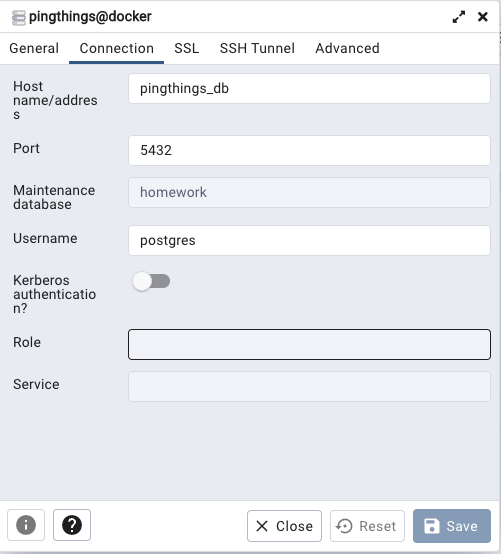

# sensors-api

## Description
This project aims to purpose a solution for sensor metadata REST API described [here](./docs/PingThings%20CTI.pdf)
as a take home assingment for Backend Engineer at [PingThings](https://www.pingthings.io/).

## Solution
This software was written in go lang (version 1.19) and uses docker containers to spin up the development
environment. Please make sure you have these software already set to be able to run it.

## Dev Environment
To spin up the whole dev environment I created a [docker-compose file](./docker/docker-compose.yml) with
a postgres and a pgadmin instances to provide the capability to query database without needing to install 
any DB client.
The postgres instance is populated with airport data, each line of the **sensors** table is populated with 
data from one airport. Thanks to [Open Flights](https://openflights.org/) that provides airport and flights data 
in their website. 

### Starting instances
To run all the containers please execute:
```shell
make infra_up
```

Once the stack is up you can check the containers sunning
```shell
docker ps
```
You should see something similar to:


To run queries you can open [pgamin](http://localhost) using the credentials 
valverde.thiago@gmail.com/p1n6th1n65. 
To configure the connection between pgadmin and postgres use the following settings:


### Running the server
Inside the root folder you can run the project using
```shell
go run main.go
```
or
```shell
make run
```

## Endpoints
The following endpoints are available:
* PUT http://localhost:8080/sensor - Creates a sensor
* POST http://localhost:8080/sensor?name=<name> - Updates a sensor by its name
* GET http://localhost:8080/sensor/<id> - Finds a sensor by its id
* GET http://localhost:8080/sensor/<id>/tags - Returns the tags for the sensor with the given id
* GET http://localhost:8080/sensor?name=<name - Finds a sensor by the given name
* GET http://localhost:8080/nearest?lat=<latitude>&long=<longitude> - Finds the nearest sensor given the coordinates

You can find a complete Postman collection with calls for all these endpoints [here](./docs/Ping%20Thinks%20Homework.postman_collection.json)
